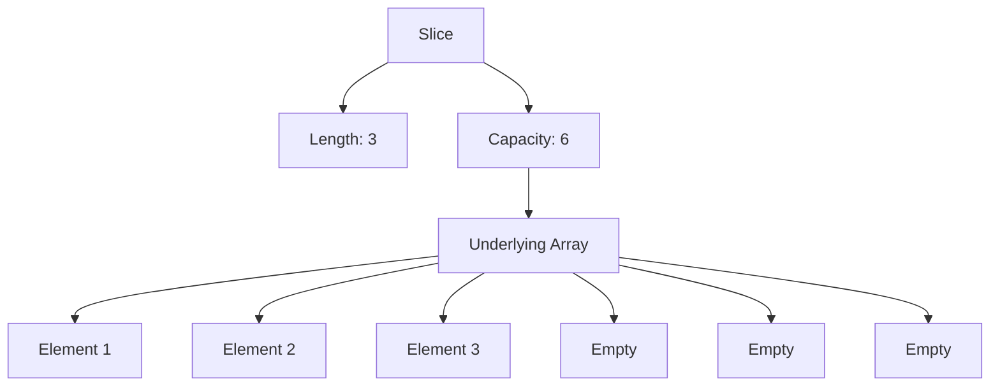

# Slices 

## What are Slices?

Slices are **wrappers around arrays** that manage underlying arrays automatically. They overcome array limitations by providing dynamic sizing.

- **Length**: Number of elements stored (use `len`)
- **Capacity**: Total size of underlying array (use `cap`)



## Behind the Scenes

- New slices create underlying arrays **double the length**
- When capacity is reached, Go creates a new array **25-50% larger** and copies values

## Declaring Slices

### Using Literals
```go
var a []int           // Nil slice
b := []int{}          // Empty slice
c := []int{1, 2, 3}   // With values
d := []int{1, 4:44, 6} // Sparse
```

### Using Make Function
```go
e := make([]int, 5)     // Length 5, capacity 5
f := make([]int, 5, 10) // Length 5, capacity 10
g := make([]int, 0, 10) // Length 0, capacity 10
```

## Append Function

Append elements to slices (must assign return value):

```go
h := make([]int, 5)
h = append(h, 10)           // Single element
h = append(h, 23, 24, 25)   // Multiple elements
i := []int{2, 3, 4}
h = append(h, i...)         // Append slice
```

## Nil vs Empty Slices

- **Nil Slice**: `var a []int` - No underlying array
- **Empty Slice**: `b := []int{}` - Has underlying array, no elements

## Slicing Operations

```go
j := []int{1, 2, 3, 4, 5, 6, 7}
k := j[2:5]    // [3, 4, 5]
l := j[:5]     // [1, 2, 3, 4, 5]
m := j[5:]     // [6, 7]
```

## Important Behaviors

### Shared Underlying Array
```go
n := []int{2, 3, 4, 5, 6, 7, 8, 9}
o := n[:3]
o = append(o, 10) // Modifies both n and o (if capacity allows)
```

### Full Slice Expression
```go
p := []int{1, 2, 3, 4, 5, 6}
q := p[2:6:6] // Limits capacity to prevent shared modifications
```

### Copy Function
```go
r := []int{1, 2, 3, 4, 5, 6}
s := make([]int, 6)
copy(s, r) // Safe copy without sharing
```

---

**Next: [Maps in Go](../fundamentals/maps)**